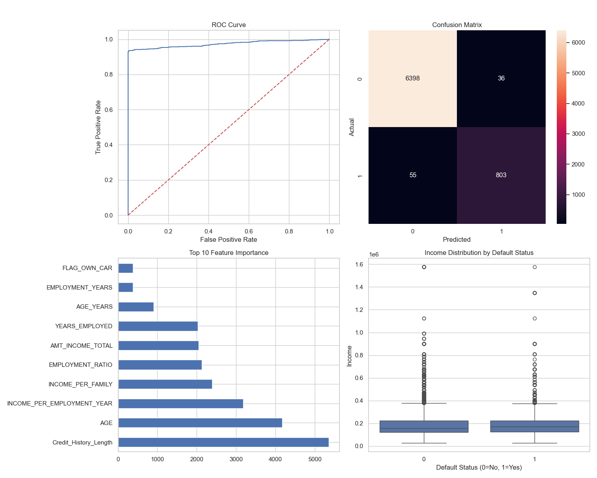
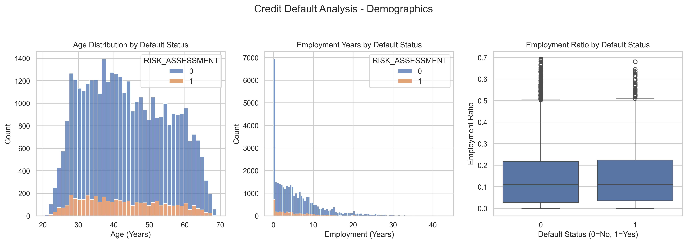

# Credit Card Approval - Model Report

Generated: 2025-09-13 10:58:12

## Overview
Credit scorecards are widely used in the financial industry as a risk control measure. These cards utilize personal information and data provided by credit card applicants to assess the likelihood of potential defaults and credit card debts in the future. Based on this evaluation, the bank can make informed decisions regarding whether to approve the credit card application. Credit scores provide an objective way to measure and quantify the level of risk involved.

Credit card approval is a crucial process in the banking industry. Traditionally, banks rely on manual evaluation of creditworthiness, which can be time-consuming and prone to errors. However, with the advent of Machine Learning (ML) algorithms, the credit card approval process has been significantly streamlined. Machine Learning algorithms have the ability to analyze large volumes of data and extract patterns, making them invaluable in credit card approval. By training ML models on historical data that includes information about applicants, their financial behavior, and credit history, banks can predict creditworthiness more accurately and efficiently.

AI in the Prediction: Artificial intelligence plays a transformative role in credit scoring. Traditional credit scoring models often fail to account for the complexity and variability of individual financial behaviors. AI, on the other hand, can process vast amounts of data, identify patterns, and make predictions with a high degree of accuracy. This allows for a more personalized and fair assessment of creditworthiness. AI credit scoring also has the potential to extend credit opportunities to underserved populations, such as those with thin credit files or those who are new to credit, by considering alternative data in the scoring process.

## Key Metrics

- ROC-AUC: **0.9734**

- Classification Report:


```
              precision    recall  f1-score   support

           0       0.99      0.99      0.99      6434
           1       0.96      0.94      0.95       858

    accuracy                           0.99      7292
   macro avg       0.97      0.97      0.97      7292
weighted avg       0.99      0.99      0.99      7292

```

## Top Feature Importances (Top 10)


````
Credit_History_Length         5356
AGE                           4167
INCOME_PER_EMPLOYMENT_YEAR    3181
INCOME_PER_FAMILY             2387
EMPLOYMENT_RATIO              2126
AMT_INCOME_TOTAL              2048
YEARS_EMPLOYED                2028
AGE_YEARS                      906
EMPLOYMENT_YEARS               380
FLAG_OWN_CAR                   375
````

## Plots

- Model Performance: 

- Demographics: 
